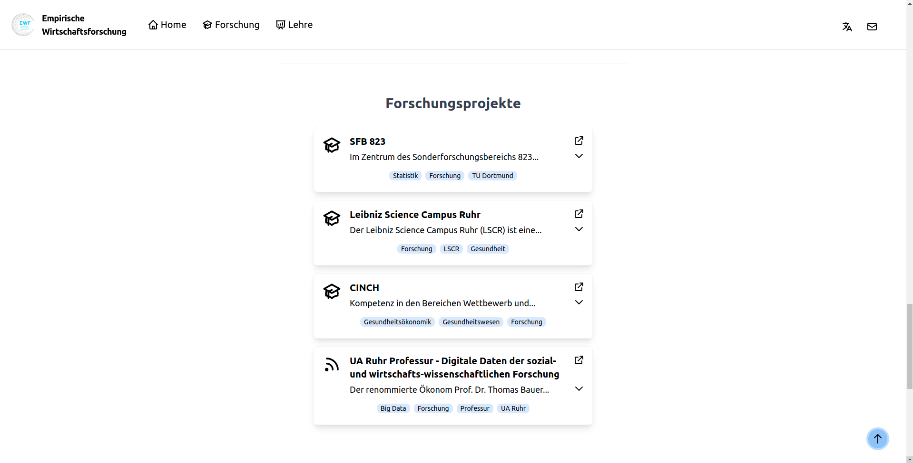
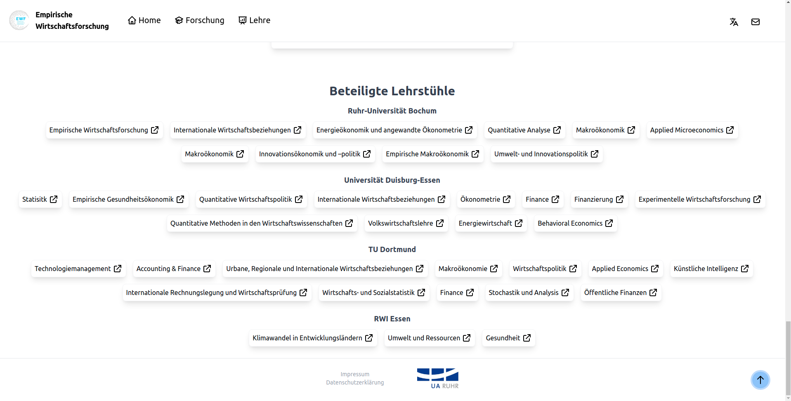

# Empirische Wirtschaftsforschung - Jamstack Website
Das hier ist die Codebasis für den Webauftritt des Kompetenzfelds Empirische Wirtschaftsforschung der UA Ruhr. Es wurde der Jamstack Ansatz verfolgt, d.h. dass in einem Buildprozess alle HTML Dateien für die Darstellung der Website generiert werden und diese nur noch durch ein CMS an den Client ausgeliefert werden müssen. Die Generierung der HTML Seiten mit all ihren Inhalten wird von einem sogenannten Static Site Generator (SSG) übernommen. Alle weitere Interaktion mit den Websiteinhalten läuft auf der Client-Seite ab, was den Betrieb eines Servers überflüssig macht.

Als Static Site Generator wurde [11ty](https://www.11ty.dev/) gewählt. Als CSS-Framework wurde [tailwindcss](https://tailwindcss.com/) genutzt, mit der zusätzlichen Erweiterung [tailwindcss/typography](https://github.com/tailwindlabs/tailwindcss-typography) um Markdown Inhalte zu rendern.

Weitere genutze Frameworks sind:
* [PostCSS](https://postcss.org/)
* [Webpack](https://webpack.js.org/)

# Inhaltsverzeichnis
- [Empirische Wirtschaftsforschung - Jamstack Website](#empirische-wirtschaftsforschung---jamstack-website)
- [Inhaltsverzeichnis](#inhaltsverzeichnis)
- [Installation](#installation)
- [Inhalte generieren](#inhalte-generieren)
- [Inhalte der Website anpassen](#inhalte-der-website-anpassen)
  - [Fließtexte](#fließtexte)
    - [Bilder](#bilder)
  - [Strukturelemente](#strukturelemente)
    - [Informations-Karten](#informations-karten)
    - [Linksammlung](#linksammlung)
    - [Data Collection](#data-collection)
  - [Andere Inhalte](#andere-inhalte)
    - [Banner Bilder](#banner-bilder)
    - [Kontakte](#kontakte)
  - [Übersetzung](#übersetzung)
  - [Links der Unterseiten](#links-der-unterseiten)
- [Production Version](#production-version)

# Installation
Um das Projekt zu builden und damit die Website Inhalte Lokal zu erstellen müssen zunächst erst die Abhängigkeiten installiert werden. Dafür kann einfach 
```
npm install
```
ausgeführt werden (in einer Konsolenumgebung). Notwendig dafür ist eine akutelle Installation von [npm](https://www.npmjs.com/).

# Inhalte generieren
Nachdem alle Abhängigkeiten installiert sind sollte man nun auch die Website aus den gegebenen Templates und Daten generieren können.
Um die Website zu builden und zusätzlich einen lokalen Webserver zu starten muss einfach 
```
npm start 
```
ausgeführt werden. Die Website sollte dann unter [localhost:8080](http://localhost:8080/) erreichbar sein. 
Falls nur die Webinhalte generiert werden sollen, ohne einen Webserver zu starten muss einfach 
```
npm build
```
ausgeführt werden. Dieser Befehl sollte verwendet werden, falls die Website am ende bei einem Static Site Hoster ausgespielt werden soll (z.B. [netlify](https://www.netlify.com/))

Die Website Daten (also HTML Seiten und weitere Daten) werden in den Ordner **dist** kopiert. Dieser wird bei Bedarf von npm selber generiert.

# Inhalte der Website anpassen
Die Inhalte der Website können an verschiedenen Punkten angepasst werden.
Dabei wird unterschieden zwischen Markdown-Dateien, die meist für f
Fließtext verwendet werden und JSON Dateien, welche für kleine Strukturelemente auf der Website genutzt werden. 

Solange es nicht in diesem Abschnitt explizit erwähnt wird, dass man den Inhalt einer Datei anpassen kann, sollte davon abgesehen werden Dateiinhalte zu verändern um die Funktionalität des Programms aufrecht zu erhalten. Es sollten nur andere Inhalte geändert werden, wenn man weiß was man tut. Faustregel hier ist im Grunde das alle Dateien die mit *.md* und *.json* angepasst werden können, während alle anderen Dateien für das aussehen und die logik der Website verantwortlich sind. Bei *.json* dateien muss man allerdings drauf achten nur die Inhalte zuändern, und nicht die Struktur und Keys, da diese wichtig sind für die generierung der Inhalte.

## Fließtexte
Fließtexte sind Hauptbestandteil der drei Hauptseiten *Home*, *Forschung* und *Lehre*. Der deutsche Text für *Home* ist bspw. unter **src/content/de/Home/content.md** hinterlegt. Unter **src/content/de/** finden sich entsprechend auch die Ornder der anderen Unterseiten. Das gleiche Prinzip gilt für die englisch sprachigen Inhalte. Diese liegen nur unter **src/content/en/**.

Die jeweiligen Fließtexte werden durch eine Markdown Datei definiert. Diese kann nach belieben gestaltet werden ([Markdwon Cheat Sheet](https://github.com/adam-p/markdown-here/wiki/Markdown-Cheatsheet)).
**WICHTIG** hier ist, dass das Rendering Framework für den Markdown Dateien Tabs in eingerückte Code-Blöcke übersetzt. Es sollten daher am besten keine Tabs genutzt werden (außer man will Code-Blöcke einbinden).

### Bilder
Desweiteren besteht die Möglichkeit Bilder mit besserer Kontrolle einzubinden als die die das Markdown Framework bietet.
Dafür muss jedoch am Anfang jeder Markdown Datei folgende Code-Zeile kopiert werden:
```

```
Diese sollte jedoch schon in allen Markdown Dateien existieren. Sie wird auch nicht übersetzt und ist damit nicht sichtbar in der Ausgabe.

Um nun Bilder einzubinden kann einfach 
```
{{ macros.image("<link-zum-Bild>", "<Bildbeschreibung>", "<size>") }}
```
geschrieben werden.
Für Bilder empfehle ich diese unter **src/assets/** abzulegen. In dem Ordner können dann auch frei eigene Unterordner erstellt werden.

Wichtig dabei ist, dass der Link zum Bild korrekt angegeben wird. Es sollte immer ein relativer Link angegeben werden ausgehen von dem Ordner in dem die Datei **.eleventy.js** liegt. Das heißt im Normalfall das man von dem Ordner *src* startet und von da aus an den Link zum Bild hinterlegt.

Neben dem Link muss auch eine Bildbeschreibung mit angegeben werden. Diese wird aber nicht angezeigt (alt text).

Abschließend kann die Größe des Bildes festgelegt werden. Standardmäßig ist das Bild *Groß* und nimmt die komplette Breite des Textes ein. Daneben gibt es noch die Optionen für *small* und *medium*. Wird eine dieser Optionen gewählt schwebt das Bild immer rechts neben dem Text, bzw wird von diesem eingerahmt.

Also zum Beispiel:<br>
Wir haben ein Bild unter **src/assets/images/test.png** abgespeichert. 
Dieses wollen wir nun auf der deutschen Home Seite einbinden, mit der Größe Medium. Dafür würden wir nun in der Datei **src/content/de/Home/content.md**
folgenden Code einfügen:
```
{{ macros.image("src/assets/images/test.png", "Test Bild", "medium") }}
```

Falls der Link zu einem Bild falsch ist, wird meistens eine Fehlermeldung ausgegeben, jedoch sollte trotzdem überprüft werden ob das Bild korrekt eingebunden wurde.

Alle Bilder werden in das [webp](https://developers.google.com/speed/webp) Format konvertiert um die Größe zu reduzieren.

## Strukturelemente
Jede der drei Hauptseiten hat auch 3 verschiedene Strukturelemente deren Inhalt frei definiert werden kann: Informations-Karten die entweder oben oder unten auf der Seite plaziert werden können, eine Linksammlung unten auf der Seite und eine Sammlung für viele Objekte die auf externe Seiten verweisen können und in verschiedene Kategorien aufgeteilt werden können.

### Informations-Karten

Die Informationskarten enthalten ein Logo, einen Namen und einen kurzen beschreibenden Text. Desweiteren kann eine Website verlinkt werden. Ein Beispiel wären die Beteiligten Unis.

Die Inhalte der Karten werden über eine JSON Datei eingestellt. Für jede der drei Hauptseiten exisitert eine JSON Datei, in der Die Daten definiert werden können.

Diese folgen ein paar Regeln:
* Wenn keine Daten hinterlegt sind, werden auch keine Karten erstellt
*  Wenn nur für eine Sprache Karten hinterlegt sind, wird für die andere Sprache trotzdem die Karten erstellt, nur mit der ersten Sprache:
   *  Gibt es deutsche Karten aber keine englischen, werden auf der englischen Seite, die deutschen Inhalte angezeigt
* Gibt es für beide Sprachen Inhalte, wird nur jeweils der Inhalt der Sprache erstellt, auch wenn diese sich von Anzahl und Inhalt unterscheiden

Folgend könnte eine Konfigurationsdatei für die Karten auf *Home* aussehen:
```
{
    "de": [
        {
            "name": "Ruhr-Universität Bochum",
            "image": "/assets/images/logos/RUB.jpg",
            "href": "https://www.ruhr-uni-bochum.de/de",
            "short": "Kurzbeschreibung"
        },
        {
            "name": "TU Dortmund",
            "image": "/assets/images/logos/tudortmundlogo.png",
            "href": "https://www.tu-dortmund.de/",
            "short": "Kurzbeschreibung"
        },
        {
            "name": "Universität Duisburg Essen",
            "image": "/assets/images/logos/unidulogo.png",
            "href": "https://www.uni-due.de/",
            "short": "Kurzbeschreibung"
        },
        {
            "name": "Universitätsallianz Ruhr ",
            "image": "/assets/images/logos/uaruhrlogo.png",
            "href": "https://www.uaruhr.de/",
            "short": "Kurzbeschreibung"
        }
    ],
    "en": [],

    "settings": {
        "items_per_row": 3,
        "title": {
            "de": "Beteiligte Institute",
            "en": "Involved Institutes"
        },
        "position": "top"
    }
}
```
Da hier zb. die englische Liste leer ist, würde auf der englischen Seite, die deutschen Karten angezeigt werden.

Unter **settings** und **items_per_row** kann defniert werden wieviele Karten maximal in einer Reihe angezeigt werden sollen. Die Karten vergrößern und verkleinern sich entsprechend der Bildschrimgröße und wieviele Elemente in der aktuellen Reihe sind. Für Mobile Geräte, wird immer nur das erste Element angezeigt. Mit hilfe von Navigations-Tasten kann durch die Elemente durch iteriert werden.
Mit dem Setting **title** kann die jeweilige Überschrift festgelegt werden und **position** bestimmt ob sich die die Karten oben oder unten aufhalten (Einstellungsmöglichkeiten: **top** und **bottom**).

Die Konfigurationsdateien für die Informationskarten liegen unter **src/_data/info_cards/**. In diesem Ordner finden sich drei verschiedene JSON Dateien, die entsprechend ihren Namens nach die Inhalte der Karten für die entsprechende Seite steuern.

### Linksammlung

Die Linksammlung kann, genau wie die Informationskarten, für jede der drei Hauptseiten erstellt werden. Dort können Links mit einen Titel und einem kurzem Beschreibungstext hinterlegt werden. Zusätzlich besteht die Möglichkeit den Link einer bestimmten Kategorie aus
* "research"
* "teaching" oder
* "other"
  
zuzuordnen. Um den Inhalt thematischer noch weiter einzuordnen kann man auch Tags hinzufügen, die am unteren Rand der Karte angezeigt werden.

Die Beschreibungstexte sind standardmäßig gekürzt, können aber mit einem Klick auf den Pfeil (siehe Bild) ausgeklappt werden. Ein Klick auf das "External"-Symbol oder das Logo führt zur hinterlegten Website.

Die Link-Elemente werden genau wie die Informations-Karten mit einer jeweiligen JSON Datei erstellt:
```
{
    "de": [
        {
            "type": "research",
            "href": "",
            "title": "Test Forschungs Link",
            "short": "Beschreibung",
            "tags": [
                "Forschung",
                "Empirische Wirtschaftsforschung",
                "EWF"
            ]
        },
        {
            "type": "teaching",
            "href": "",
            "title": "Test Lehre Link",
            "short": "Beschreibung",
            "tags": [
                "Lehre",
                "neues Modul",
                "Vorlesung"
            ]
        },
        {
            "type": "other",
            "href": "",
            "title": "Test Diverses Link",
            "short": "Beschreibung",
            "tags": [
                "anderes",
                "News",
                "Was gibt's neues"
            ]
        }
    ],
    "en": [
        {
            "type": "other",
            "href": "",
            "title": "Test",
            "short": "Description",
            "tags": [
                "other",
                "News",
                "whats going on"
            ]
        }
    ],
    "settings": {
        "title": {
            "en": "Research Projects",
            "de": "Forschungsprojekte"
        }
    }
}
```
In diesem Fall würden sich die Links zwischen der deutschen und der englischen Seite unterscheiden, da die Inhalte für die englische Sprache nicht leer sind.
Der SSG generiert hier also für die englische Seite nur einen Link, während er für die deutsche Seite drei Stück erstellen würde.

In dem Settings Bereich kann diesmal nur der Titel des Bereichs angepasst werden.

Die Konfigurationsdateien für die Link-Sammlungen der drei Hauptseiten liegen unter **src/_data/footer_links/**.


### Data Collection

Die Data Collection befindet sich immer am Ende einer Seite und ist für Sammlungen von vielen Daten gedacht, die hauptsächlich aus einem sehr kurzem Text bestehen und vielleicht auf externe Inhalte verweisen.
Sie können zusätzlich in verschiedene Kategorien aufgeteilt werden. Auf Mobilen Geräten sind die einzelen Elemente in ihrer Kategorie verborgen und können mit einem Klick angezeigt bzw. expanded werden.


Gesteuert werden diese Elemente wieder über eine JSON Datei, die für jede der jeweiligen Hauptseiten exisitert, z.B.:
```
{
    "de": [
        {
            "name": "Empirische Wirtschaftsforschung",
            "href": "https://www.wiwi.ruhr-uni-bochum.de/empwifo/index.html.de",
            "category": "Ruhr-Universität Bochum"
        },
        {
            "name": "Statisitk",
            "href": "https://www.stat.wiwi.uni-due.de/",
            "category": "Universität Duisburg-Essen"
        },
        ...
    ],
    "en": [
        {
            "name": "Empirical Economics",
            "href": "https://www.wiwi.ruhr-uni-bochum.de/empwifo/index.html.en",
            "category": "Ruhr-Universität Bochum"
        },
        {
            "name": "Statistics",
            "href": "https://www.stat.wiwi.uni-due.de/",
            "category": "Universität Duisburg-Essen"
        },
        ...
    ],
    "settings": {
        "number_columns": 3,
        "title": {
            "de": "Beteiligte Lehrstühle",
            "en": "Involved Research Chairs"
        }
    }
}
```

Diese Konfigurations-Dateien findet man unter **src/_data/bottom_data_colletion/**.

## Andere Inhalte
Neben diesen Hauptinhalten gibt es noch ein paar weitere Inhalte die angepasst werden können. Dazu zählen die Banner Bilder die auf jeder Seite angezeigt werden und die Kontaktinformationen. 

### Banner Bilder
Hier können alle Bilder eingebunden werden, die man sich wünscht. Wieder empfehle ich diese Bilder unter **src/assets/images/banner/** abzulegen. Ich empfehle Bilder so zuzuschneiden, dass diese eine Höhe von ungefähr 320 Pixeln haben. So nehmen sie nicht zuviel Platz auf der Seite ein.

Welche Bilder als Banner Kandidaten genutzt werden sollen, ist in der JSON Datei *banner_images* in dem Ordner **src/_data/** definiert. Dort können für jede Seite die ein Banner hat, das Bild festgelegt werden. Wichtig hier ist wieder, dass das führende **src** aus dem link entfernt wird. Je **kleiner** die Bilder sind die dafür ausgewählt werden, desto schneller lädt die Website! Also ist es nicht unbedingt zu empfehlen ein 10 MB Bild dort einzubinden. Allerdings werden auch diese Bilder in das [webp](https://developers.google.com/speed/webp) Format konvertiert um Speicherplatz einzusparen.

### Kontakte

Die Kontakte, die unter der Kontakt-Seite (Brief-Symbol oben rechts) gefunden werden können, werden ebenso über eine JSON Datei definiert und dann entsprechend generiert.

Die aktuelle Konfiguration sieht folgend aus:
```
{
    "contacts": [
        {
            "title": "Ruhr Universität Bochum",
            "adress": "Universitätsstraße 150\n44801 Bochum",
            "web": "https://www.ruhr-uni-bochum.de/de",
            "phone": "0234 32201",
            "mail": "webteam@uv.rub.de",
            "image": "/assets/images/logos/RUB.jpg"
        },
        {
            "title": "Technische Universität Dortmund",
            "phone": "(0231) 755-1",
            "mail": "presse@tu-dortmund.de",
            "adress": "August-Schmidt-Straße 1\n44227 Dortmund",
            "web": "https://www.tu-dortmund.de/",
            "image": "/assets/images/logos/tudortmundlogo.png"
        },
        {
            "title": "Universität Duisburg-Essen",
            "adress": "Campus Duisburg\nFortsthausweg 2\n47057
                       Duisburg\n\nCampus Essen\nUniverstätsstraße 2\n45141 Essen",
            "phone": "+49(0)203 37-91800",
            "mail": "webredaktion@uni-due.de",
            "web": "https://www.uni-due.de/",
            "image": "/assets/images/logos/unidulogo.png"
        }
    ]
}
```
Um umbrüche in dem Text zu schaffen, kann einfach das Escape Symbol "\n" genutzt werden (Gilt für alle Texte innerhalb von JSON Dateien).

Diese Einstellungsdatei liegt unter **src/_data/contacts.json**

## Übersetzung
Unter der Datei **src/_data/translations.json** sind die Übersetzungen für einige Keywords der Website sowohl für Deutsch als auch Englisch hinterlegt. Diese können dort einfach angepasst werden.

## Links der Unterseiten
Jede Unterseite hat natürlich seinen eigenen Link (zb. http://localhost:8080/de/forschung/). Diese unterscheiden sich in der jeweiligen Sprache (vorheriger Link in Englisch wäre: http://localhost:8080/en/research/). Wie diese Unterseiten heißen ist in der Datei **src/_data/slugs.json** festgelegt. Falls Namen von Unterseiten geändert werden sollen, dies immer in dieser Datei vornehmen, da die Software die die Website erstellt auf die Keyworte, die in der Datei zufinden sind, angewiesen ist!

# Production Version
Wenn die Seite letztendlich bei einem Hoster veröffentlich wird sollte die *Environment variable* **NODE_ENV** auf **production** gesetzt werden!
Dies führt dazu dass nicht benötigte Teile von genutzten Frameworks (vorallem Tailwindcss) entfernt werden, was oft zu einem sehr hohen Ersparnis an Speicherplatz und dementsprechend einer reduzierten Seitenladezeit führt. Falls der Hoster das setzen dieser Variable nicht unterstützt, sollte die in der Datei **.env** gesetzt werden!